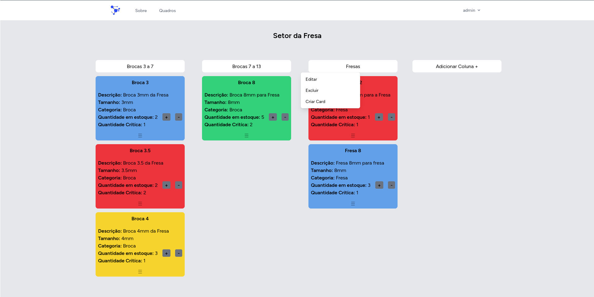

<h1 align="center">Soft Sort</h1>

## Sobre Soft Sort

O Soft Sort é um sistema para a gestão de insumos/consumíveis com uma abordagem centrada em card sort. Nesse método, o acompanhamento do fluxo e a disponibilidade dos materiais são realizados por meio de cartões e etiquetas, que são utilizados para classificar e organizar os itens em diversas categorias.

Essa estratégia simplifica o controle e a identificação de materiais, tornando mais eficiente o monitoramento daqueles que podem estar prestes a se esgotar no estoque. 

## Instalação

1. **git clone** https://github.com/Gubriel/Soft-Sort
2. **cd** /caminho/para/**Soft-Sort**
3. **composer install**
4. Copie **.env.example** para **.env** na pasta raiz do projeto.
5. Abra o novo arquivo **.env** e altere o nome do banco **(DB_DATABASE)** para o nome do seu banco, nome de usuario **(DB_USERNAME)** e senha **(DB_PASSWORD)** correnspondentes a do **seu** banco.
6. **php artisan** key:generate
7. **php artisan** migrate
8. **php artisan** db:seed
9. **npm install**

#### Após estas configurações rode a aplicação com *php artisan serve* e *npm run dev*, acesse o navegador no *localhost* porta *8000*, (127.0.0.1:8000), Email: *Admin@admin.com*, senha *12345678*
